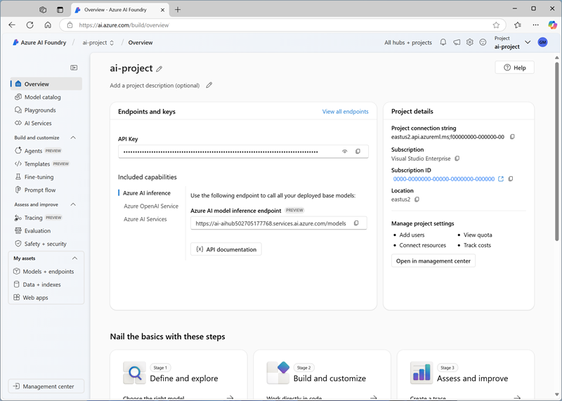

---
lab:
  title: Mengembangkan aplikasi obrolan berkemampuan audio
  description: Mempelajari cara menggunakan Azure AI Foundry untuk membuat aplikasi AI generatif yang mendukung input audio.
---

# Mengembangkan aplikasi obrolan berkemampuan audio

Dalam latihan ini, Anda menggunakan model AI generatif *Phi-4-multimodal-instruct* untuk menghasilkan respons terhadap perintah yang mencakup file audio. Anda akan menyediakan aplikasi bantuan AI untuk perusahaan pemasok produsen dengan menggunakan Azure AI Foundry dan layanan SDK Python OpenAI untuk meringkas pesan suara pelanggan.

Meskipun latihan ini didasarkan pada Python, Anda dapat mengembangkan aplikasi serupa menggunakan beberapa SDK khusus bahasa; termasuk:

- [Proyek Azure AI untuk Python](https://pypi.org/project/azure-ai-projects)
- [Pustaka OpenAI untuk Python](https://pypi.org/project/openai/)
- [Proyek Azure AI untuk Microsoft .NET](https://www.nuget.org/packages/Azure.AI.Projects)
- [Pustaka klien Azure OpenAI untuk Microsoft .NET](https://www.nuget.org/packages/Azure.AI.OpenAI)
- [Proyek Azure AI untuk JavaScript](https://www.npmjs.com/package/@azure/ai-projects)
- [Pustaka Azure OpenAI untuk TypeScript](https://www.npmjs.com/package/@azure/openai)

Latihan ini memakan waktu sekitar **30** menit.

## Membuat proyek Azure OpenAI

Mari mulai dengan menyebarkan model dalam proyek Azure AI Foundry.

1. Di browser web, buka [portal Azure AI Foundry](https://ai.azure.com) di `https://ai.azure.com` dan masuk menggunakan kredensial Azure Anda. Tutup semua tip atau panel mulai cepat yang terbuka saat pertama kali Anda masuk, dan jika perlu, gunakan logo **Azure AI Foundry** di kiri atas untuk menavigasi ke halaman beranda, yang terlihat sama dengan gambar berikut:

    

1. Di beranda, pada bagian **Jelajahi model dan kemampuan** , cari`Phi-4-multimodal-instruct` model; yang akan kita gunakan dalam proyek kita.
1. Dalam hasil pencarian, pilih model **Phi-4-multimodal-instruct** untuk melihat detailnya, lalu di bagian atas halaman model, pilih **Gunakan model ini**.
1. Saat diminta untuk membuat proyek, masukkan nama yang valid untuk proyek Anda dan perluas **Opsi tingkat lanjut**.
1. Pilih **Kustomisasi** dan tentukan pengaturan berikut untuk hub Anda:
    - **Sumber daya Azure AI Foundry**: *Nama yang valid untuk sumber daya Azure AI Foundry Anda*
    - **Langganan**: *Langganan Azure Anda*
    - **Grup sumber daya**: *Buat atau pilih grup sumber daya*
    - **Wilayah**: *Pilih **AI Foundry yang direkomendasikan***\*

    > \* Sumber daya Azure OpenAI dibatasi oleh kuota model regional. Jika batas kuota terlampaui di kemudian hari dalam latihan, Anda mungkin perlu membuat sumber daya lain di wilayah yang berbeda. Anda dapat memeriksa ketersediaan regional terbaru untuk model tertentu dalam [dokumentasi Azure AI Foundry](https://learn.microsoft.com/azure/ai-foundry/how-to/deploy-models-serverless-availability#region-availability)

1. Pilih **Create**, lalu tunggu proyek Anda dibuat.

    Operasi ini mungkin memakan waktu beberapa saat hingga selesai.

1. Pilih **Setuju dan Lanjutkan** untuk menyetujui ketentuan model, lalu pilih **Sebarkan** untuk menyelesaikan penyebaran model Phi.

1. Saat proyek Anda dibuat, detail model akan dibuka secara otomatis. Perhatikan nama penyebaran model Anda; yaitu **Phi-4-multimodal-instruct**

1. Di panel navigasi di sebelah kiri, pilih **Gambaran Umum** untuk melihat halaman utama untuk proyek Anda; yang terlihat seperti ini:

    > **Catatan**: Jika *kesalahan izin** Tidak Cukup* tampil, gunakan tombol **Perbaiki saya** untuk mengatasinya.

    

## Membuat aplikasi klien

Sekarang setelah Anda menerapkan model, Anda dapat menggunakan Azure AI Foundry dan SDK Inferensi Model Azure AI untuk mengembangkan aplikasi yang mengobrol dengannya.

> **Tips**: Anda dapat memilih untuk mengembangkan solusi Anda sendiri menggunakan Python atau Microsoft C#. Ikuti instruksi di bagian yang sesuai untuk bahasa yang Anda pilih.

### Menyiapkan konfigurasi aplikasi

1. Di portal Azure AI Foundry, lihat halaman **Gambaran Umum** untuk proyek Anda.
1. **Di area detail** Proyek, perhatikan **titik** akhir proyek Azure AI Foundry. Anda akan menggunakan titik akhir ini untuk menyambungkan ke proyek Anda di aplikasi klien.
1. Buka tab browser baru (biarkan portal Azure AI Foundry tetap terbuka di tab yang sudah ada). Kemudian di tab baru, telusuri [Portal Azure](https://portal.azure.com) di `https://portal.azure.com`; masuk menggunakan kredensial Azure Anda jika diminta.

    Tutup pemberitahuan selamat datang apa pun untuk melihat halaman beranda portal Azure.

1. Gunakan tombol **[\>_]** di sebelah kanan bilah pencarian di bagian atas halaman untuk membuat Cloud Shell baru di portal Azure, dengan memilih lingkungan ***PowerShell*** dengan tidak ada penyimpanan pada langganan Anda.

    Cloud shell menyediakan antarmuka baris perintah dalam panel di bagian bawah portal Azure. Anda dapat mengubah ukuran atau memaksimalkan panel ini untuk mempermudah pekerjaan.

    > **Catatan**: Jika sebelumnya Anda telah membuat cloud shell yang menggunakan lingkungan *Bash* , alihkan ke ***PowerShell***.

1. Di toolbar cloud shell, di menu **Pengaturan**, pilih **Buka versi Klasik** (ini diperlukan untuk menggunakan editor kode).

    **<font color="red">Pastikan Anda telah beralih ke versi klasik cloud shell sebelum melanjutkan.</font>**

1. Di panel cloud shell, masukkan perintah berikut untuk mengkloning repo GitHub yang berisi file kode untuk latihan ini (ketik perintah, atau salin ke clipboard lalu klik kanan di baris perintah dan tempel sebagai teks biasa):

    ```
   rm -r mslearn-ai-audio -f
   git clone https://github.com/MicrosoftLearning/mslearn-ai-language
    ```

    > **Tips**: Saat Anda menempelkan perintah ke cloudshell, ouput mungkin mengambil sejumlah besar buffer layar. Anda dapat menghapus layar dengan memasukkan `cls` perintah untuk mempermudah fokus pada setiap tugas.

1. Setelah repositori dikloning, navigasikan ke folder yang berisi file kode aplikasi obrolan:  

    ```
   cd mslearn-ai-language/Labfiles/09-audio-chat/Python
    ````

1. Di panel baris perintah cloud shell, masukkan perintah berikut untuk menginstal pustaka yang akan Anda gunakan:

    ```
   python -m venv labenv
   ./labenv/bin/Activate.ps1
   pip install -r requirements.txt azure-identity azure-ai-projects openai
    ```

1. Masukkan perintah berikut untuk mengedit file konfigurasi yang telah disediakan:

    ```
   code .env
    ```

    File dibuka dalam editor kode.

1. Dalam file kode, ganti tempat penampung **your_project_endpoint** dengan titik akhir untuk proyek Anda (disalin dari halaman **Gambaran umum** proyek di portal Azure AI Foundry), dan tempat penampung **your_model_deployment** dengan nama yang Anda tetapkan ke penyebaran model Phi-4-multimodal-instruct.

1. Setelah Anda mengganti placeholder, di editor kode,gunakan perintah **CTRL+S** atau **Klik kanan > Simpan** untuk menyimpan perubahan Anda dan kemudian gunakan perintah **CTRL+Q** atau **Klik kanan > Keluar** untuk menutup editor kode sambil tetap membuka baris perintah cloud shell.

### Menulis kode untuk menyambungkan ke proyek Anda dan mendapatkan klien obrolan untuk model Anda

> **Tips**: Saat Anda menambahkan kode, pastikan untuk mempertahankan indentasi yang benar.

1. Masukkan perintah berikut untuk mengedit file kode:

    ```
   code audio-chat.py
    ```

1. Dalam file kode, perhatikan pernyataan yang sudah ada yang telah ditambahkan di bagian atas file untuk mengimpor namespace SDK yang diperlukan. Kemudian, temukan komentar **Tambahkan referensi**, tambahkan kode berikut untuk mereferensikan namespace di pustaka yang Anda instal sebelumnya:

    ```python
   # Add references
   from azure.identity import DefaultAzureCredential
   from azure.ai.projects import AIProjectClient
    ```

1. Dalam fungsi **utama**, di bawah komentar **Dapatkan pengaturan konfigurasi**, perhatikan bahwa kode memuat string koneksi proyek dan nilai nama penyebaran model yang Anda tentukan dalam file konfigurasi.

1. Temukan komentar **Inisialisasi klien proyek** dan tambahkan kode berikut untuk menghubungkan proyek Azure AI Foundry Anda:

    > **Tips**: Berhati-hatilah untuk mempertahankan tingkat indentasi yang benar untuk kode Anda.

    ```python
   # Initialize the project client
   project_client = AIProjectClient(            
       credential=DefaultAzureCredential(
           exclude_environment_credential=True,
           exclude_managed_identity_credential=True
       ),
       endpoint=project_endpoint,
   )
    ```

1. Di bawah komentar **Dapatkan klien obrolan**, tambahkan kode berikut untuk membuat objek klien untuk mengobrol dengan model Anda:

    ```python
   # Get a chat client
   openai_client = project_client.get_openai_client(api_version="2024-10-21")
    ```

### Menulis kode untuk mengirimkan perintah berbasis audio

Sebelum mengirimkan permintaan, kita perlu mengodekan file audio untuk permintaan tersebut. Kemudian kita dapat melampirkan data audio ke pesan pengguna dengan perintah untuk LLM. Perhatikan bahwa kode menyertakan loop untuk memungkinkan pengguna memasukkan perintah hingga mereka memasukkan "quit". 

1. Di bawah komentar **Kodekan file audio**, masukkan kode berikut untuk menyiapkan file audio berikut:

    <video controls src="https://github.com/MicrosoftLearning/mslearn-ai-language/raw/refs/heads/main/Instructions/media/avocados.mp4" title="Permintaan untuk avocado" width="150"></video>

    ```python
   # Encode the audio file
   file_path = "https://github.com/MicrosoftLearning/mslearn-ai-language/raw/refs/heads/main/Labfiles/09-audio-chat/data/avocados.mp3"
   response = requests.get(file_path)
   response.raise_for_status()
   audio_data = base64.b64encode(response.content).decode('utf-8')
    ```

1. Di bawah komentar **Dapatkan respons terhadap input audio**, tambahkan kode berikut untuk mengirimkan perintah:

    ```python
   # Get a response to audio input
   response = openai_client.chat.completions.create(
       model=model_deployment,
       messages=[
           {"role": "system", "content": system_message},
           { "role": "user",
               "content": [
               { 
                   "type": "text",
                   "text": prompt
               },
               {
                   "type": "input_audio",
                   "input_audio": {
                       "data": audio_data,
                       "format": "mp3"
                   }
               }
           ] }
       ]
   )
   print(response.choices[0].message.content)
    ```

1. Gunakan perintah **CTRL+S** untuk menyimpan perubahan Anda ke file kode. Anda juga dapat menutup editor kode (**CTRL+Q**) jika mau.

### Masuk ke Azure dan jalankan aplikasi.

1. Di panel baris perintah cloud shell, masukkan perintah berikut untuk menjalankan aplikasinya:

    ```
   az login
    ```

    **<font color="red">Anda harus masuk ke Azure - meskipun sesi cloud shell sudah diautentikasi.</font>**

    > **Catatan**: Dalam sebagian besar skenario, hanya menggunakan *login* az sudah cukup. Namun, jika Anda memiliki langganan di berbagai penyewa, Anda mungkin perlu menentukan penyewa dengan menggunakan *parameter --penyewa* . Lihat [Masuk ke Azure secara interaktif menggunakan Azure CLI](https://learn.microsoft.com/cli/azure/authenticate-azure-cli-interactively) untuk detailnya.
    
1. Saat diperintahkan, ikuti instruksi untuk membuka halaman masuk di tab baru dan masukkan kode autentikasi yang diberikan dan kredensial Azure Anda. Kemudian selesaikan proses masuk di baris perintah, pilih langganan yang berisi pusat penyimpanan Azure AI Foundry jika diperintahkan.

1. Di panel baris perintah cloud shell, masukkan perintah berikut untuk menjalankan aplikasinya:

    ```
   python audio-chat.py
    ```

1. Saat diminta, masukkan perintah  

    ```
   Can you summarize this customer's voice message?
    ```

1. Tinjau responsnya.

### Menggunakan file audio lain

1. Di editor kode untuk kode aplikasi Anda, temukan kode yang Anda tambahkan sebelumnya di bawah komentar **Kodekan file audio**. Kemudian, ubah url jalur file sebagai berikut untuk menggunakan file audio yang berbeda untuk permintaan (meletakkan kode yang ada setelah jalur file):

    ```python
   # Encode the audio file
   file_path = "https://github.com/MicrosoftLearning/mslearn-ai-language/raw/refs/heads/main/Labfiles/09-audio-chat/data/fresas.mp3"
    ```

    File baru terdengar seperti ini:

    <video controls src="https://github.com/MicrosoftLearning/mslearn-ai-language/raw/refs/heads/main/Instructions/media/fresas.mp4" title="Permintaan untuk stroberi" width="150"></video>

 1. Gunakan perintah **CTRL+S** untuk menyimpan perubahan Anda ke file kode. Anda juga dapat menutup editor kode (**CTRL+Q**) jika mau.

1. Di panel baris perintah cloud shell di bawah editor kode, masukkan perintah berikut untuk menjalankan aplikasi:

    ```
   python audio-chat.py
    ```

1. Saat diminta, masukkan perintah berikut: 
    
    ```
   Can you summarize this customer's voice message? Is it time-sensitive?
    ```

1. Tinjau responsnya. Kemudian masukkan `quit` untuk keluar dari program.

    > **Catatan**: Dalam aplikasi sederhana ini, kita belum menerapkan logika untuk mempertahankan riwayat percakapan; sehingga model akan memperlakukan setiap perintah sebagai permintaan baru tanpa konteks perintah sebelumnya.

1. Anda dapat terus menjalankan aplikasi, memilih jenis perintah yang berbeda dan mencoba permintaan yang berbeda. Setelah selesai, tekan enter `quit` untuk mengakhiri program.

    Jika Anda punya waktu, Anda dapat memodifikasi kode untuk menggunakan perintah sistem yang berbeda dan file audio yang dapat diakses di internet.

    > **Catatan**: Dalam aplikasi sederhana ini, kami belum menerapkan logika untuk mempertahankan riwayat percakapan; sehingga model akan memperlakukan setiap permintaan sebagai permintaan baru tanpa konteks perintah sebelumnya.

## Ringkasan

Dalam latihan ini, Anda menggunakan Azure AI Foundry dan SDK Azure AI Inference untuk membuat aplikasi klien menggunakan model multimodal untuk menghasilkan respons terhadap audio.

## Penghapusan

Setelah selesai menjelajahi Azure AI Foundry, Anda harus menghapus sumber daya yang telah Anda buat di latihan ini untuk menghindari biaya Azure yang tidak perlu.

1. Kembali ke tab browser yang berisi portal Azure (atau buka kembali [portal Azure](https://portal.azure.com) di `https://portal.azure.com` tab browser baru) dan lihat konten grup sumber daya tempat Anda menyebarkan sumber daya yang digunakan dalam latihan ini.
1. Pada toolbar pilih **Hapus grup sumber daya**.
1. Masukkan nama grup sumber daya untuk mengonfirmasi bahwa Anda ingin menghapusnya, dan pilih Hapus.
